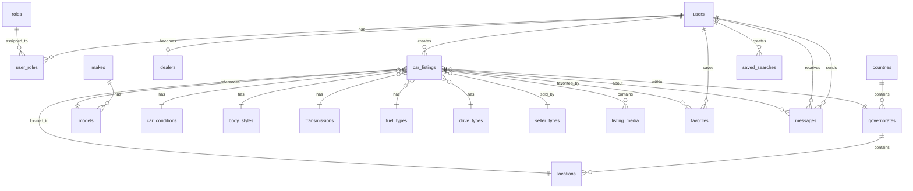

# Database Schema Documentation
## Caryo Marketplace

**Version:** 1.0.0 (Current Implementation)
**Last Updated:** September 12, 2025
**Database:** PostgreSQL 16+ (H2 for testing)

---

## 🎯 **CURRENT IMPLEMENTATION**

This documentation reflects the **actual working database schema** as implemented in the codebase to avoid any breaking changes.

### **Naming Conventions (Current)**
- **Car Data**: Uses `makes` and `models` tables (not `car_brands`/`car_models`)
- **Foreign Keys**: `make_id` references the `makes` table
- **Bilingual Fields**: All user-facing content has `_en` and `_ar` variants
- **Timestamps**: Most tables use `created_at` and `updated_at`

### **Design Decisions**
- **Strategic Denormalization**: Search-critical fields duplicated for performance
- **Redundancy by Design**: `governorate_id` + `location_id` both stored for query optimization
- **Cascade Rules**: Explicitly defined for all foreign key relationships

---

## 📊 **ENTITY RELATIONSHIP DIAGRAM**



---

## 🏗️ **CORE TABLES**

### **users**
```sql
CREATE TABLE users (
    id BIGINT GENERATED BY DEFAULT AS IDENTITY PRIMARY KEY,
    username VARCHAR(50) UNIQUE NOT NULL,
    email VARCHAR(50) UNIQUE NOT NULL,
    password VARCHAR(120) NOT NULL,
    created_at TIMESTAMP NOT NULL DEFAULT CURRENT_TIMESTAMP,
    updated_at TIMESTAMP NOT NULL DEFAULT CURRENT_TIMESTAMP
);
```

### **dealers**
Dealer-specific information with trial and subscription management.

```sql
CREATE TABLE dealers (
    id BIGINT GENERATED BY DEFAULT AS IDENTITY PRIMARY KEY,
    user_id BIGINT NOT NULL UNIQUE,
    business_name VARCHAR(255) NOT NULL,
    business_email VARCHAR(255) NOT NULL,
    business_phone VARCHAR(50) NOT NULL,
    commercial_registration VARCHAR(100),
    tax_id VARCHAR(100),

    -- Trial System Fields (Phase 1A)
    trial_started_at TIMESTAMP WITH TIME ZONE DEFAULT CURRENT_TIMESTAMP,
    trial_listings_count INTEGER DEFAULT 0 NOT NULL,
    trial_expired BOOLEAN DEFAULT FALSE NOT NULL,
    trial_extended_until TIMESTAMP WITH TIME ZONE,
    timezone VARCHAR(50) DEFAULT 'Asia/Damascus',

    -- Subscription Management Fields
    subscription_tier VARCHAR(50) DEFAULT 'trial',
    subscription_started_at TIMESTAMP WITH TIME ZONE,
    subscription_status VARCHAR(50) DEFAULT 'trial',
    subscription_next_billing_date TIMESTAMP WITH TIME ZONE,
    subscription_cancelled_at TIMESTAMP WITH TIME ZONE,

    -- Notification Tracking (JSONB)
    notifications_sent JSONB DEFAULT '[]'::jsonb,

    -- Feature Flags per Dealer
    can_create_listings BOOLEAN DEFAULT TRUE NOT NULL,
    payment_warning BOOLEAN DEFAULT FALSE NOT NULL,

    -- Timestamps
    created_at TIMESTAMP NOT NULL DEFAULT CURRENT_TIMESTAMP,
    updated_at TIMESTAMP NOT NULL DEFAULT CURRENT_TIMESTAMP,

    -- Foreign Key Constraints
    FOREIGN KEY (user_id) REFERENCES users(id) ON DELETE CASCADE
);

-- Indexes for Trial System Performance
CREATE INDEX idx_dealers_trial_expired ON dealers(trial_expired) WHERE trial_expired = false;
CREATE INDEX idx_dealers_subscription_tier ON dealers(subscription_tier);
CREATE INDEX idx_dealers_subscription_status ON dealers(subscription_status);
CREATE INDEX idx_dealers_trial_started_at ON dealers(trial_started_at);
```

**Design Rationale:**
- **Trial System**: 2-month trial with 15 total listings limit (Phase 1A implementation)
- **UTC Timestamps**: All trial/subscription dates stored in UTC for consistent calculations
- **Timezone Field**: Dealer's local timezone for display purposes only
- **JSONB Notifications**: Flexible storage for notification history (e.g., `["50_time", "75_usage"]`)
- **Feature Flags**: Per-dealer toggles for listing creation and payment warnings
- **Subscription Tiers**: `trial`, `basic`, `advanced`, `professional`, `suspended`
- **Subscription Status**: `trial`, `active`, `payment_failed`, `suspended`, `cancelled`

**Trial Business Logic:**
- **Trial Duration**: 2 months from `trial_started_at`
- **Listing Limit**: 15 total listings during trial period
- **Grace Period**: 3 days after trial expiry (configurable)
- **Trial Extension**: Support can extend via `trial_extended_until` field

**Field Documentation:**
- `trial_started_at`: Trial start timestamp (UTC). Defaults to signup time.
- `trial_listings_count`: Number of listings created during trial (max 15 for 2-month trial)
- `trial_expired`: True if trial has expired (time or listings)
- `trial_extended_until`: Extended trial end date (for support cases)
- `timezone`: Dealer timezone (for display, calculations in UTC)
- `subscription_tier`: Current subscription tier: trial, basic, advanced, professional, suspended
- `subscription_started_at`: When paid subscription started (UTC)
- `subscription_status`: Status: trial, active, payment_failed, suspended, cancelled
- `subscription_next_billing_date`: Next billing date (UTC)
- `subscription_cancelled_at`: When subscription was cancelled (UTC)
- `notifications_sent`: Array of notification IDs sent (e.g., `["50_time", "75_usage"]`)
- `can_create_listings`: Feature flag: can dealer create new listings?
- `payment_warning`: Show payment warning banner in dashboard?

### **roles & user_roles**
```sql
CREATE TABLE roles (
    id INT GENERATED BY DEFAULT AS IDENTITY PRIMARY KEY,
    name VARCHAR(20) UNIQUE NOT NULL
);

CREATE TABLE user_roles (
    user_id BIGINT NOT NULL,
    role_id INTEGER NOT NULL,
    PRIMARY KEY (user_id, role_id),
    FOREIGN KEY (user_id) REFERENCES users (id) ON DELETE CASCADE,
    FOREIGN KEY (role_id) REFERENCES roles (id) ON DELETE CASCADE
);
```

---

## 🌍 **GEOGRAPHIC TABLES**

### **locations**
```sql
CREATE TABLE locations (
    id BIGINT GENERATED BY DEFAULT AS IDENTITY PRIMARY KEY,
    display_name_en VARCHAR(100) NOT NULL,
    display_name_ar VARCHAR(100) NOT NULL,
    slug VARCHAR(100) NOT NULL UNIQUE,
    country_code VARCHAR(2) NOT NULL,
    region VARCHAR(100),
    latitude DECIMAL(10, 8),
    longitude DECIMAL(11, 8),
    is_active BOOLEAN DEFAULT TRUE,
    created_at TIMESTAMP NOT NULL DEFAULT CURRENT_TIMESTAMP,
    updated_at TIMESTAMP NOT NULL DEFAULT CURRENT_TIMESTAMP
);
```

**Design Note**: Both `governorate_id` and `location_id` are stored in `car_listings` for **query performance optimization**. This intentional redundancy allows:
- Fast filtering by governorate without joins
- Precise location filtering when needed
- Backward compatibility with existing queries

---

## 🚗 **CAR DATA TABLES (Current Implementation)**

### **makes** (Car Brands)
```sql
CREATE TABLE makes (
    id BIGINT GENERATED BY DEFAULT AS IDENTITY PRIMARY KEY,
    name VARCHAR(255) NOT NULL UNIQUE,
    display_name_en VARCHAR(255),
    display_name_ar VARCHAR(255),
    country_of_origin VARCHAR(255),
    logo_url VARCHAR(255),
    slug VARCHAR(255) NOT NULL UNIQUE,
    is_active BOOLEAN DEFAULT TRUE,
    created_at TIMESTAMP NOT NULL DEFAULT CURRENT_TIMESTAMP,
    updated_at TIMESTAMP NOT NULL DEFAULT CURRENT_TIMESTAMP
);
```

**Entity Mapping**:
- Java Entity: `CarBrand`
- Maps to: `@Table(name = "makes")`

### **models** (Car Models)
```sql
CREATE TABLE models (
    id BIGINT GENERATED BY DEFAULT AS IDENTITY PRIMARY KEY,
    make_id BIGINT NOT NULL,
    name VARCHAR(255) NOT NULL,
    display_name_en VARCHAR(255),
    display_name_ar VARCHAR(255),
    year_start INT,
    year_end INT,
    slug VARCHAR(255) NOT NULL UNIQUE,
    is_active BOOLEAN DEFAULT TRUE,
    created_at TIMESTAMP NOT NULL DEFAULT CURRENT_TIMESTAMP,
    updated_at TIMESTAMP NOT NULL DEFAULT CURRENT_TIMESTAMP,
    FOREIGN KEY (make_id) REFERENCES makes(id) ON DELETE CASCADE
);
```

**Entity Mapping**:
- Java Entity: `CarModel`
- Maps to: `@Table(name = "models")`
- Foreign Key: `@JoinColumn(name = "make_id")`

---

## 📝 **CAR LISTINGS**

### **car_listings**
The core table for car advertisements with strategic denormalization.

```sql
CREATE TABLE car_listings (
    id BIGINT GENERATED BY DEFAULT AS IDENTITY PRIMARY KEY,
    title VARCHAR(100) NOT NULL,
    description TEXT NOT NULL,
    price DECIMAL(10, 2) NOT NULL,
    currency VARCHAR(3) DEFAULT 'USD',
    mileage INT NOT NULL,
    model_year INT NOT NULL,

    -- Foreign Key References
    seller_id BIGINT NOT NULL,
    model_id BIGINT NOT NULL,
    location_id BIGINT,
    governorate_id BIGINT,
    condition_id BIGINT,
    body_style_id BIGINT,
    transmission_id BIGINT,
    fuel_type_id BIGINT,
    drive_type_id BIGINT,
    seller_type_id BIGINT,

    -- Denormalized Fields for Search Performance
    brand_name_en VARCHAR(100),
    brand_name_ar VARCHAR(100),
    model_name_en VARCHAR(100),
    model_name_ar VARCHAR(100),
    governorate_name_en VARCHAR(100),
    governorate_name_ar VARCHAR(100),

    -- Car Specifications
    vin VARCHAR(17),
    stock_number VARCHAR(50),
    exterior_color VARCHAR(50),
    doors INTEGER,
    cylinders INTEGER,

    -- Status Fields
    approved BOOLEAN DEFAULT FALSE,
    sold BOOLEAN DEFAULT FALSE,
    archived BOOLEAN DEFAULT FALSE,
    expired BOOLEAN DEFAULT FALSE,
    is_user_active BOOLEAN DEFAULT TRUE,

    -- Timestamps
    expiration_date TIMESTAMP,
    created_at TIMESTAMP NOT NULL DEFAULT CURRENT_TIMESTAMP,
    updated_at TIMESTAMP NOT NULL DEFAULT CURRENT_TIMESTAMP,

    -- Foreign Key Constraints
    FOREIGN KEY (seller_id) REFERENCES users(id) ON DELETE CASCADE,
    FOREIGN KEY (model_id) REFERENCES models(id) ON DELETE RESTRICT,
    FOREIGN KEY (location_id) REFERENCES locations(id) ON DELETE SET NULL,
    FOREIGN KEY (governorate_id) REFERENCES governorates(id) ON DELETE SET NULL
);
```

**Design Rationale:**
- **Denormalized Search Fields**: Brand, model, and governorate names stored directly for fast searching
- **Intentional Redundancy**: Both `location_id` and `governorate_id` for query flexibility
- **Status Tracking**: Multiple boolean flags for different listing states

### **listing_media**
```sql
CREATE TABLE listing_media (
    id BIGINT GENERATED BY DEFAULT AS IDENTITY PRIMARY KEY,
    listing_id BIGINT NOT NULL,
    file_key VARCHAR(255) NOT NULL,
    file_name VARCHAR(255) NOT NULL,
    content_type VARCHAR(100) NOT NULL,
    file_size BIGINT NOT NULL,
    sort_order INTEGER DEFAULT 0,
    is_primary BOOLEAN DEFAULT FALSE,
    media_type VARCHAR(20) NOT NULL CHECK (media_type IN ('image', 'video')),
    created_at TIMESTAMP NOT NULL DEFAULT CURRENT_TIMESTAMP,

    FOREIGN KEY (listing_id) REFERENCES car_listings(id) ON DELETE CASCADE
);
```

---

## 🔧 **REFERENCE TABLES**

All reference tables follow the same pattern with bilingual support:

### **car_conditions**
```sql
CREATE TABLE car_conditions (
    id INT GENERATED BY DEFAULT AS IDENTITY PRIMARY KEY,
    name VARCHAR(20) UNIQUE NOT NULL,
    display_name_en VARCHAR(50) NOT NULL,
    display_name_ar VARCHAR(50) NOT NULL,
    slug VARCHAR(50) NOT NULL
);
```

### **body_styles**
```sql
CREATE TABLE body_styles (
    id INT GENERATED BY DEFAULT AS IDENTITY PRIMARY KEY,
    name VARCHAR(20) UNIQUE NOT NULL,
    display_name_en VARCHAR(50) NOT NULL,
    display_name_ar VARCHAR(50) NOT NULL,
    slug VARCHAR(50) NOT NULL
);
```

### **fuel_types**
```sql
CREATE TABLE fuel_types (
    id INT GENERATED BY DEFAULT AS IDENTITY PRIMARY KEY,
    name VARCHAR(20) UNIQUE NOT NULL,
    display_name_en VARCHAR(50) NOT NULL,
    display_name_ar VARCHAR(50) NOT NULL,
    slug VARCHAR(50) NOT NULL
);
```

### **transmissions**
```sql
CREATE TABLE transmissions (
    id INT GENERATED BY DEFAULT AS IDENTITY PRIMARY KEY,
    name VARCHAR(20) UNIQUE NOT NULL,
    display_name_en VARCHAR(50) NOT NULL,
    display_name_ar VARCHAR(50) NOT NULL,
    slug VARCHAR(50) NOT NULL
);
```

### **drive_types**
```sql
CREATE TABLE drive_types (
    id INT GENERATED BY DEFAULT AS IDENTITY PRIMARY KEY,
    name VARCHAR(20) UNIQUE NOT NULL,
    display_name_en VARCHAR(50) NOT NULL,
    display_name_ar VARCHAR(50) NOT NULL,
    slug VARCHAR(50) NOT NULL
);
```

### **seller_types**
```sql
CREATE TABLE seller_types (
    id INT GENERATED BY DEFAULT AS IDENTITY PRIMARY KEY,
    name VARCHAR(20) UNIQUE NOT NULL,
    display_name_en VARCHAR(50) NOT NULL,
    display_name_ar VARCHAR(50) NOT NULL,
    slug VARCHAR(50) NOT NULL
);
```

**Design Notes:**
- **No updated_at**: Reference tables rarely change, so no update triggers needed
- **Consistent Structure**: All reference tables follow identical pattern
- **Bilingual Support**: English and Arabic display names for all reference data

---

## 💬 **USER INTERACTION TABLES**

### **favorites**
```sql
CREATE TABLE favorites (
    id BIGINT GENERATED BY DEFAULT AS IDENTITY PRIMARY KEY,
    user_id BIGINT NOT NULL,
    listing_id BIGINT NOT NULL,
    created_at TIMESTAMP NOT NULL DEFAULT CURRENT_TIMESTAMP,

    FOREIGN KEY (user_id) REFERENCES users(id) ON DELETE CASCADE,
    FOREIGN KEY (listing_id) REFERENCES car_listings(id) ON DELETE CASCADE,

    UNIQUE(user_id, listing_id)
);
```

### **messages**
```sql
CREATE TABLE messages (
    id BIGINT GENERATED BY DEFAULT AS IDENTITY PRIMARY KEY,
    sender_id BIGINT NOT NULL,
    receiver_id BIGINT NOT NULL,
    listing_id BIGINT,
    content TEXT NOT NULL,
    is_read BOOLEAN DEFAULT FALSE,
    created_at TIMESTAMP NOT NULL DEFAULT CURRENT_TIMESTAMP,
    updated_at TIMESTAMP NOT NULL DEFAULT CURRENT_TIMESTAMP,

    FOREIGN KEY (sender_id) REFERENCES users(id) ON DELETE CASCADE,
    FOREIGN KEY (receiver_id) REFERENCES users(id) ON DELETE CASCADE,
    FOREIGN KEY (listing_id) REFERENCES car_listings(id) ON DELETE SET NULL
);
```

### **saved_searches**
```sql
CREATE TABLE saved_searches (
    id BIGINT GENERATED BY DEFAULT AS IDENTITY PRIMARY KEY,
    user_id BIGINT NOT NULL,
    name VARCHAR(255),
    search_parameters TEXT NOT NULL,
    email_notifications_enabled BOOLEAN DEFAULT TRUE,
    last_notified_at TIMESTAMP,
    created_at TIMESTAMP NOT NULL DEFAULT CURRENT_TIMESTAMP,
    updated_at TIMESTAMP NOT NULL DEFAULT CURRENT_TIMESTAMP,

    FOREIGN KEY (user_id) REFERENCES users(id) ON DELETE CASCADE
);
```

---

## 🔧 **DATABASE TRIGGERS & FUNCTIONS**

### **Automatic Timestamp Updates**

```sql
-- Function to update modified timestamp
CREATE OR REPLACE FUNCTION update_modified_column()
RETURNS TRIGGER AS $$
BEGIN
    NEW.updated_at = CURRENT_TIMESTAMP;
    RETURN NEW;
END;
$$ language 'plpgsql';
```

### **Tables with Automatic Timestamp Updates**
- ✅ `users` - User profile changes
- ✅ `dealers` - Dealer information and trial/subscription updates
- ✅ `locations` - Location data updates
- ✅ `makes` - Brand information changes
- ✅ `models` - Model data updates
- ✅ `car_listings` - Listing modifications
- ✅ `messages` - Message updates
- ✅ `saved_searches` - Search criteria changes

### **Tables WITHOUT Automatic Updates (By Design)**
- ❌ `roles` - Static system roles
- ❌ `user_roles` - Role assignments are immutable
- ❌ `car_conditions` - Static reference data
- ❌ `body_styles` - Static reference data
- ❌ `fuel_types` - Static reference data
- ❌ `transmissions` - Static reference data
- ❌ `drive_types` - Static reference data
- ❌ `seller_types` - Static reference data
- ❌ `listing_media` - File metadata is immutable
- ❌ `favorites` - Simple timestamp on creation only

### **Denormalization Sync Triggers**

```sql
-- Sync denormalized fields in car_listings when makes/models change
CREATE TRIGGER car_listing_before_insert_update
    BEFORE INSERT OR UPDATE ON car_listings
    FOR EACH ROW EXECUTE FUNCTION sync_denormalized_fields();

CREATE TRIGGER make_after_update
    AFTER UPDATE ON makes
    FOR EACH ROW EXECUTE FUNCTION sync_brand_names_in_listings();

CREATE TRIGGER model_after_update
    AFTER UPDATE ON models
    FOR EACH ROW EXECUTE FUNCTION sync_model_names_in_listings();
```

---

## 🚀 **PERFORMANCE OPTIMIZATION**

### **Strategic Denormalization**

**Why Denormalize?**
The `car_listings` table includes denormalized fields for search performance:

```sql
-- Fast search without joins (denormalized)
SELECT * FROM car_listings
WHERE brand_name_en ILIKE '%toyota%'
  AND approved = true;

-- vs expensive join query
SELECT cl.* FROM car_listings cl
JOIN models m ON cl.model_id = m.id
JOIN makes mk ON m.make_id = mk.id
WHERE mk.display_name_en ILIKE '%toyota%';
```

**Redundancy by Design:**
- `governorate_id` + `location_id`: Allows filtering by either level without joins
- Brand/model names: Eliminates joins for search queries
- Governorate names: Fast location-based filtering

### **Index Strategy**

```sql
-- Performance Indexes
CREATE INDEX idx_car_listings_seller ON car_listings(seller_id);
CREATE INDEX idx_car_listings_model ON car_listings(model_id);
CREATE INDEX idx_car_listings_location ON car_listings(location_id);
CREATE INDEX idx_car_listings_governorate ON car_listings(governorate_id);
CREATE INDEX idx_car_listings_price ON car_listings(price);

-- Search Optimization Indexes
CREATE INDEX idx_car_listings_brand_name_en ON car_listings(brand_name_en);
CREATE INDEX idx_car_listings_brand_name_ar ON car_listings(brand_name_ar);
CREATE INDEX idx_car_listings_model_name_en ON car_listings(model_name_en);
CREATE INDEX idx_car_listings_model_name_ar ON car_listings(model_name_ar);

-- Status Indexes
CREATE INDEX idx_car_listings_approved ON car_listings(approved) WHERE approved = true;
CREATE INDEX idx_car_listings_active ON car_listings(approved, sold, archived, expired)
    WHERE approved = true AND sold = false AND archived = false AND expired = false;
```

---

## 📋 **MIGRATION STRATEGY**

### **Current Migration Files**
- `V1__Initial_Schema.sql` - Core tables and structure
- `V2__reference_data.sql` - Reference data population
- `V7__Refactor_Geographic_Hierarchy.sql` - Geographic improvements
- `V15__create_messaging_tables.sql` - Messaging system
- `V22__Seed_Syrian_Car_Brands_and_Models.sql` - Syrian market data
- `V23__Seed_Comprehensive_Syrian_Car_Brands_and_Models.sql` - Extended data
- `V24__Seed_Professional_Syrian_Car_Data.sql` - Production data
- `V51__Add_trial_fields_to_dealers.sql` - **Dealer trial system (Phase 1A)**

### **Data Integrity Rules**

```sql
-- Cascade Rules Summary (Current Implementation):
-- users -> car_listings: CASCADE (delete user removes their listings)
-- users -> user_roles: CASCADE (delete user removes role assignments)
-- car_listings -> listing_media: CASCADE (delete listing removes media)
-- makes -> models: CASCADE (delete make removes models)
-- models -> car_listings: RESTRICT (cannot delete model with listings)
-- locations -> car_listings: SET NULL (listings survive location deletion)
```

---

## 🎯 **SUMMARY**

### **Current Implementation Highlights**

1. **Working Schema**: Uses `makes`/`models` tables as currently implemented
2. **Entity Compatibility**: Matches existing `CarBrand`/`CarModel` entity mappings
3. **Performance Optimized**: Denormalized fields for fast searching
4. **Bilingual Support**: English/Arabic variants for all user-facing content
5. **Strategic Redundancy**: Performance over pure normalization where justified

### **Key Relationships**

- **Car Hierarchy**: `makes` (1) → `models` (many)
- **Listings**: Reference `models` table via `model_id`
- **Geographic**: Both `location_id` and `governorate_id` for flexibility
- **Denormalized Search**: Brand/model names stored directly in listings

**This schema documentation reflects the actual working implementation and will not break existing functionality.** 🚀

---

## 📝 **FUTURE IMPROVEMENTS (Non-Breaking)**

When ready for enhancements, consider:
- Adding `created_at`/`updated_at` to reference tables
- Renaming `makes`/`models` to `car_brands`/`car_models` via migration
- Adding transaction tables for payment system
- Enhanced audit logging tables

*These improvements can be implemented gradually without breaking existing functionality.*